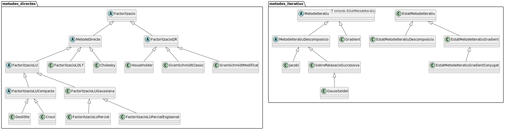

# Resolució de sistemes lineals &mdash; `aln.py`

En aquest entregable he intentat organitzar millor el mòdul empaquetant el codi
corresponent a cada mètode en **classes**. A més, per evitar la repetició de codi, he fet servir l'**herència** per 
reutilitzar parts del codi en diversos mètodes, formant així la següent jerarquia de classes:





Cadascuna de les classes no abstractes (amb una _C_ de fons verd) corresponen als mètodes de l'entregable, mentre que
les classes abstractes (amb una _A_ de fons blau) contenen codi que es reutilitza a les classes derivades.


Per exemple, el codi per calcular el residu d'ortogonalitat d'una factorització _QR_ és el mateix per a tots els mètodes
d'aquest tipus:

```py
class FactoritzacioQR(Factoritzacio):
    # ...
    def residu_ortogonalitat(self) -> np.floating:
        assert self.Q is not None
        assert self.R is not None
        return np.linalg.norm(np.eye() - self.Q @ self.R)
```

He considerat que la factorització LU amb el mètode de Gauss sense pivotament és un cas particular de les 
factoritzacions amb pivotament, però amb el vector de permutació $p = (1,2,...,n)$.

Al fitxer `aln.py` es poden trobar les funcions que es demanen a la tasca, però totes